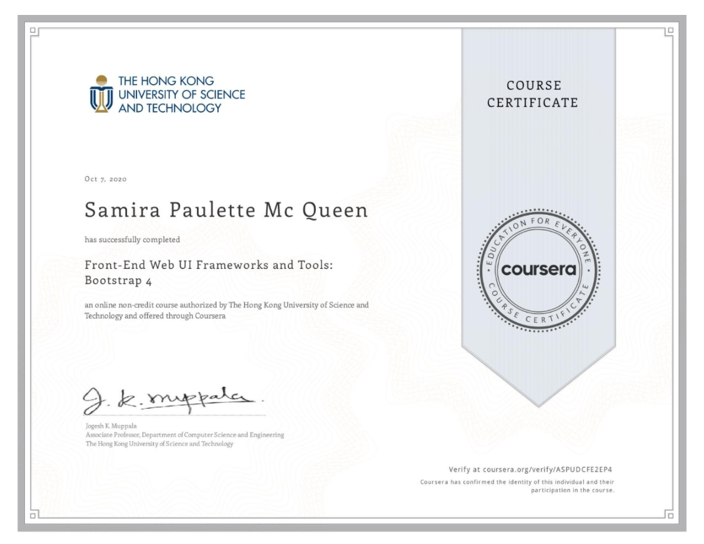
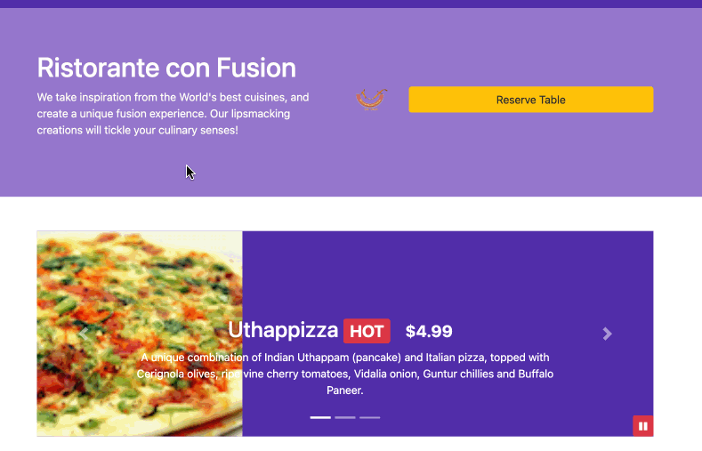

# Front-End Web UI Frameworks and Tools: Bootstrap 4
This project was done in my Coursera Course

# About the Author
Name: Samira Mc Queen
[LinkedIn](https://www.linkedin.com/in/samira-mc-queen-1882431a7/)

Free Spririted Caribbean Woman.
Software Developer and aspiring Game Developer

# Project 

## Experience with Project
- Before doing the course it was not my first time using Bootstrap. The course definitley made certain concepts stick more. 
- Bootstrap is definitely a tool that can be used to make coding easier. 

# Application Features
- User can view the website of teh restaurant and see what conFusion has to offer
- User can send feedback in the Contact Us page

# Frontend Built With
- JavaScrpt
- Bootstrap

# Backend Built With
- Json file

# Project setup
Once the project is downloaded locally on your device do the following:
`
npm install
`

If there are dependencies that need updating or you want to check:
`
npm outdated
`

If there are outdated dependencies:
`
npm updated
`

To check and update packages in package.json:
`
npx npm-check-updates -u
`

### Compiles and hot-reloads for development
`
npm run start
`

### Compiles and minifies for production
`
npm run build
`

### Lints and fixes files
`
npm run lint
`
